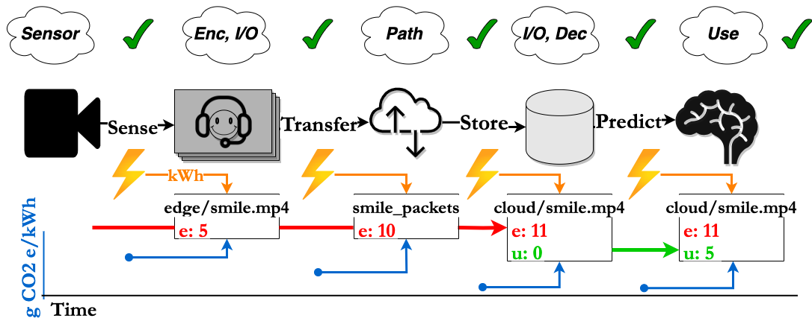

# Toward a Life Cycle Assessment for the Carbon Footprint of Data

## Data has a carbon footprint
Data has a carbon footprint, but it is difficult to track down a carbon cost estimate due to the many complexities of its life cycle, like when data is exchanged between two separate parties. Without estimates for costs, it is challenging to know how to best develop and evaluate methods for carbon emission reduction throughout its life cycle. In our HotCarbon 2023 paper, we outline a technical framework for performing carbon accounting on data and also define new opportunities for carbon reduction. In doing so, we define two categories for data: embodied and operational carbon. Embodied carbon corresponds to the carbon from collecting, tranferring, and storing data. Operational carbon corresponds to using data. We don't want to waste resources on data that isn't ever used (i.e., data with high embodied costs compared to the operational costs)!   

## Purpose of this repository
This repository serves as a gentle introduction to how we can account for the carbon footprint of data. We focus on two example components of the data life cycle and show how to produce cost estimates: 
1. Data collection and compression (`device_power/CAISO_MISO_webcam_experiments.py`)
2. Data transfer over the internet (`network/route_estimator.py`)

# Installation
## Prerequisites
1. Python 3
2. We use the Intel Power Gadget to obtain the power draw of hardware components. The Intel Power Gadget is compatible with 2nd Generation up to 10th Generation Intel Core processors and has native support for Mac and Windows. There are existing ports for [Linux](https://github.com/vitillo/power_gadget), but we cannot verify their accuracy. 
3. traceroute 

## Steps
1. Clone, fork, or download the repo
2. Install Python requirements via `pip install -r requirements.txt`
3. Install the [Intel Power Gadget](https://www.intel.com/content/www/us/en/developer/articles/tool/power-gadget.html)

# Electricity Generation Sources
We collected publicly-available generation source data from both the [Midwest Independent System Operator](https://www.misoenergy.org/) (MISO) and [California Independent System Operator](https://www.caiso.com/Pages/default.aspx)
(CAISO). These raw data can be found in `carbon_intensity_pricing/`. We display the data sources in the below table for each applicable figure:

Figure        | Data Source(s)
------------- | -------------
2             | https://www.misoenergy.org/markets-and-operations/real-time--market-data/market-reports/ https://www.caiso.com/TodaysOutlook/Pages/supply.aspx#section-supply-trend
3             | https://www.co2signal.com/

# Carbon Intensity Methodology
The carbon intensity of each generation source in kg CO2e/MWh = g CO2e/kWh for the Midwest Independent System Operator and the California Independent System Operator are in `MISO_carbon_intensity.json` and `CAISO_carbon_intensity.json` respectively. Each JSON object contains the links to the references.

## CI for low-carbon sources
Low-carbon sources are given life cycle carbon intensities. This metric includes emissions from manufacturing renewable components, ongoing operations, and disposing of the materials at the end of the component lifetime. We rely on metrics from the [National Renewable Energy Lab](https://www.nrel.gov/docs/fy21osti/80580.pdf) that calibrate a median life cycle value across multiple published life cycle asessments. For CAISO, the biogas CI is derived from a [study](https://onlinelibrary.wiley.com/doi/full/10.1002/elsc.201000073?casa_token=XonEKx8AkwgAAAAA%3APwu3O6k_tPFVCgStvsOudMk-JuxklWwq4WewR1xNd5KG2bQb2M6jldvV6NSDsf6saQm_DsINDgXXeuU) where the CI is the average of the 10 plant CIs given in Figure 3 of their paper. 

## CI for fossil fuels
The fossil fuels are given a grid-specific *combustion CI* derived from historical 2020 data to improve the geographical accuracy of the grid carbon intensities. Combustion CI does not include the rest of the power plant life cycle. You can visualize the data [here](https://www.epa.gov/egrid/data-explorer) by selecting **output emission rates (lb/MWh)** for **CO2 equivalent** for **all fuels** at the **balancing authority level** for **2020**. From there, you can click on the MISO and CAISO grids by navigating to the Midwest or California on the map. 

## Average CI for the grid
Let $G_t$ denote the total power generation in MW at time $t$, $G_{ts}$ denote the generation in MW at time $t$ by generation source $s \in S$, and $CI_s$ denote the carbon intensity in kg CO2 e/MWh of generation source $s \in S$. Then, we define the average carbon intensity $C_t$ at time $t$ as: 
$$C_t = \sum_{s \in S} (G_{ts} / {G_t}) \times CI_s$$
where the total generation is
$$G_{t} = \sum_{s \in S} G_{ts}$$
So, this means that average carbon intensity simply is a weighted average of the percent of electricity that is generated by each source multiplied by the carbon intensity of the generation source.

# Power Methodology
There are two plausible ways to compute the energy estimate in the context of the Intel Power Gadget. The first is using the "empirical" log data, which may contain a small I/O delay. To avoid this delay, we chose the "theoretical" energy, assuming that the power was logged at each discrete sampling time defined by the first log time and multiples of the sampling rate. Specifically, let $\mathbf{p} = [p_1, p_2, \ldots, p_r]$ be the power readings in Watts during the collection of a webcam video and $\Delta$ be the sensor sampling rate in seconds. The total energy in Joules is given by:
$$E = \sum_{t = 1}^{r} p_t \times \Delta$$

We can then convert the value to kWh by taking $E = E / 3.6 \times 10^6$ to match the grid average carbon intensity.  

# Carbon emissions
We compute the carbon emissions via:

$$\mathrm{emissions} = C_t \times E$$

where $C_t$ is the average carbon intensity at time $t$ and $E$ is the energy consumed during the collection of the webcam video.

# (Approximately) Reproducing Plots
The below table gives the correspondence between Figure x in the paper and the code file that reproduces that plot. 

Figure        | Code File
------------- | -------------
2             | `device_power/CAISO_MISO_webcam_experiments.py`
3             | `network/route_estimator.py`

Before running `device_power/CAISO_MISO_webcam_experiments.py` you must first start the power logging that saves the power for your hardware to a file at a given sampling rate. You will need to configure the sampling rate in milliseconds and the path that your logger will use like in the below image. Note that the GUI sampling rate is distinct from the *logging sampling rate*, which is the quantity that needs to be configured.

This value will be prompted by `device_power/CAISO_MISO_webcam_experiments.py` so please make note of it.

Before running `network/route_estimator.py` you need to get an API key from [CO2 Signal](https://www.co2signal.com/) and you will be prompted for it similar to the above. 

# Results
The stored results from the 24 short video experiment run on the 2019 Macbook Pro is in `experiment_results/results.csv`. All of the plots are in the `figs/` directory. The emission intensity estimate for internet data transfer at the time of the experiment is found in `network/result.json` 

